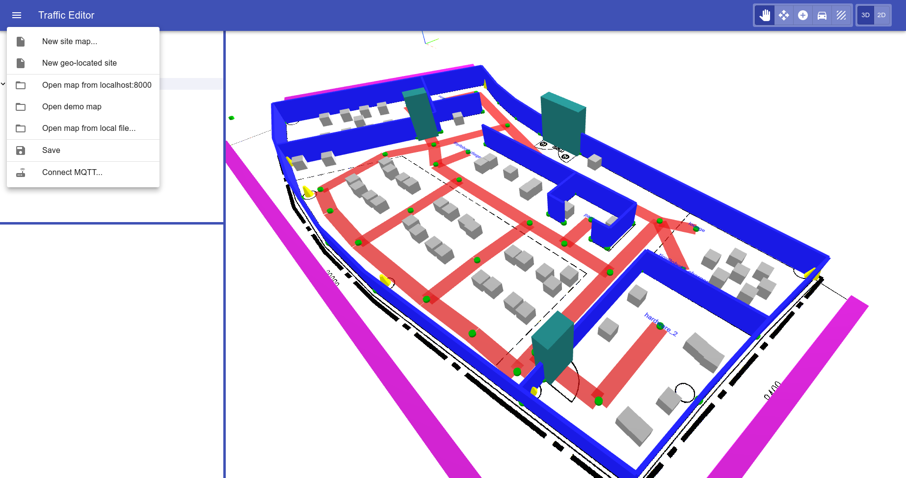

# traffic-editor-web

**EVERYTHING HEREIN IS UNDER CONSTRUCTION**

This repo will contain a Javascript port and upgrade of the Qt-based traffic-editor previously used in RMF.
The editor will be available as a standalone Electron app, or as a JS package suitable for embedding into browser-based user interfaces alongside other RMF UI panels.


**Dive right in!!** : https://open-rmf.github.io/traffic-editor-js/

On the GUI, just select "Open Demo Map" on the drop-down menu. 



## Install dependencies

```
cd traffic-editor-pwa
npm i
```

## Run stuff
```
cd traffic-editor-pwa
npm run start
```
Now open `localhost:3000` in Chrome (has to be Chrome for local filesystem acecss)

## Load custom building Map

We will use [rmf_demos](https://github.com/open-rmf/rmf_demos) maps as an example.
User can provide a rmf building map folder to a minimal "building map server", and this will provide an endpoint for the web GUI to retrieve the map.

```bash
cd traffic-editor-minimal-map-server
python3 server.py --map_dir ${../rmf_demos/rmf_demos_maps/maps/airport_terminal/}
```

Now, on the GUI, click " Open map from localhost:8000" on the drop-down menu.
